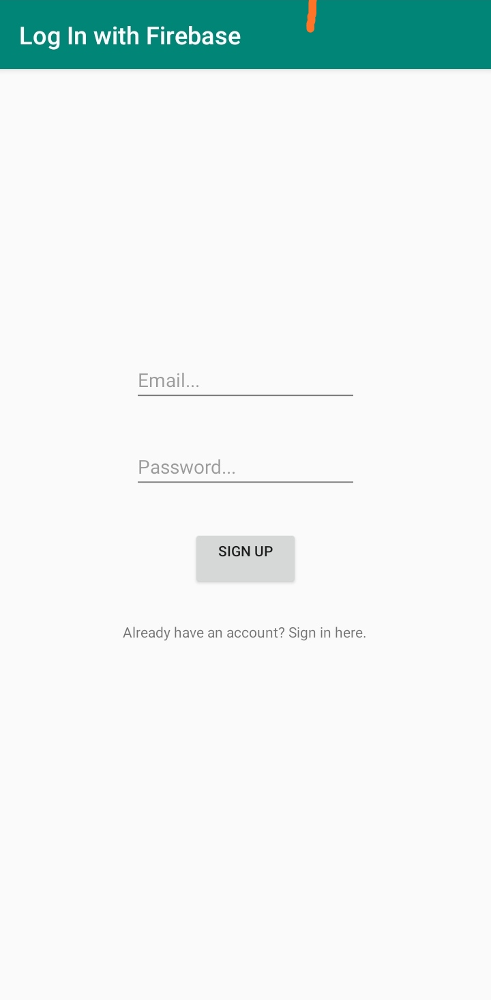
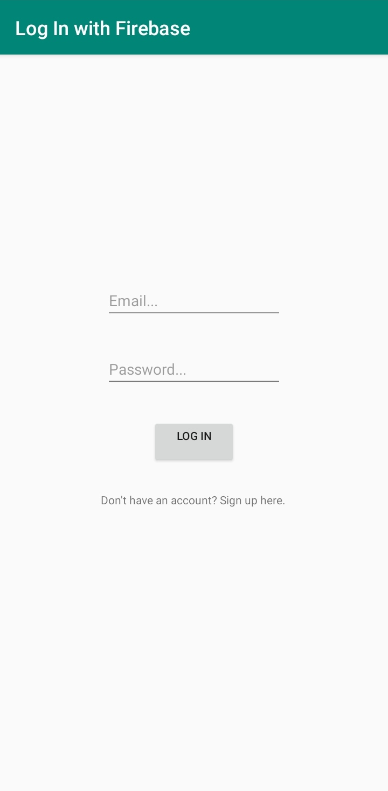

# LoginPage-using-Firebase-Android
Storing Login credentials and using the to log in and log out.
Also adding data while sign up.
Firebase is used to store data at backend.
 
## Example Pictures

 
 
 

## Download

## Developer
Gaurav Raj - [LinkedIn](https://www.linkedin.com/in/gaurav-raj-5893b0195/)
